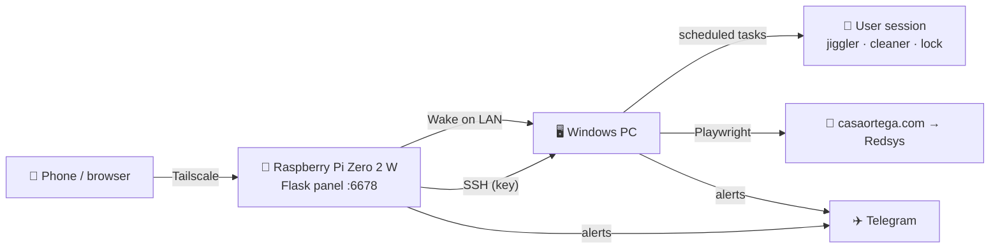

# 🖥️ ZeroDesk

       -0078D4?style=flat-square&logo=windows&logoColor=white)  

> **Your gaming PC, from anywhere, without leaving it on.** A tiny web panel running on a **Raspberry Pi Zero 2 W** that wakes the PC with **Wake on LAN**, monitors it, runs your scripts on it over **SSH** and turns it off again — all from your phone, through **Tailscale**. 🚀

The Pi is always on and sips power; the PC only runs when there is something to do. From the panel you see CPU, RAM, disk and GPU at a glance, power the PC on/off/restart/sleep, lock it, keep it from locking, launch maintenance scripts, and even top up a prepaid wallet that needs a real browser — which the Pi (415 MB of RAM) could never run itself, so it borrows the PC for 30 seconds. ⚡

---

## 🧰 Tech stack

| Area | Technology |
|------|------------|
| Panel backend | Python 3.13 · Flask 3 · waitress |
| Panel frontend | Vanilla HTML + CSS + JS — inline SVG icons and charts, zero dependencies |
| Telemetry | SQLite (`telemetria.db`), 30 days of history, bucketed on the fly per range |
| PC control | OpenSSH Server on Windows (key auth only) + PowerShell 5.1 scripts |
| Power on | Wake on LAN magic packet (UDP broadcast from the Pi) |
| Desktop actions | Windows Task Scheduler tasks that run inside the user session |
| Browser automation | Playwright + headless Chromium (wallet top-up) |
| Alerts | Telegram Bot API |
| Services | systemd (`recarga-web`) — starts with the Pi, restarts itself |
| Remote access | Tailscale (WireGuard VPN, no ports opened) |
| Hardware | Raspberry Pi Zero 2 W · Windows 11 PC (AtlasOS) |
| CI/CD | GitHub Actions — automatic versioning, tag and release on every push |

---

## ✨ What the panel does

### 🩺 Monitor
- 📊 **System status** — CPU, RAM, disk C:, GPU load, GPU temperature and uptime with live bars.
- 🧾 **PC info** — hostname, Windows edition and build, CPU, GPU, local and public IP, session state.
- 🌐 **Services** — casaortega.com, the Redsys payment gateway and the Telegram API, with latency; plus the Pi's own CPU, RAM and temperature.
- 📈 **Performance charts** — PC CPU / RAM / GPU temp and Pi CPU / RAM / temp, with **1H · 6H · 24H · 7D · 30D** ranges and hover tooltips. Gaps (PC off, Pi rebooting) break the line instead of lying.

### 🎛️ Control
| Button | How it works |
|--------|--------------|
| ⚡ **Power on** | Wake on LAN from the Pi, then waits until SSH answers |
| ⏻ **Shut down** | `shutdown /s` over SSH, waits until the PC is really gone |
| 🔄 **Restart** | `shutdown /r`, tracks it going down **and** coming back |
| 🌙 **Sleep** | `SetSuspendState` — wakes up again with *Power on* |
| 🔒 **Lock** / 🚪 **Sign out** | Scheduled tasks that run inside the desktop session |
| 🖱️ **Anti-lock** | Nudges the mouse 1 px every 5 min so Windows never locks (off by default) |
| 🍓 **Reboot Pi** | `systemctl reboot` through a single-command sudoers rule; the page reconnects by itself |

### 🧪 Scripts
- 🧹 **RNX Cache Cleaner `/todo`** — from [CS2-Cache-Cleaner](https://github.com/Ren0X1/CS2-Cache-Cleaner), launched elevated inside the user session (it restarts Explorer and imports `HKCU` settings, so it can't run from SSH). Its log is streamed into the panel's terminal.
- 🌐 **Open NAT 3074** — from [T6-Open-Nat-Script](https://github.com/Ren0X1/T6-Open-Nat-Script): opens port 3074 TCP/UDP in the Windows Firewall and on the router via UPnP.
- 💳 **Wallet top-up** — logs into casaortega.com, fills the Redsys gateway with the Pluxee card and waits for the bank. If the PC was off, it is woken up for the job and shut down afterwards; if it was on, it is left alone.

### 🖥️ Terminal
Every operation shows its steps (`[ OK ]`, `[FAIL]`, timings) and the PC's output live; when idle, the terminal shows the operation log.

---

## 🗺️ How it fits together



---

## 📁 Repository layout

```
ZeroDesk/
├── panel/                  # 🍓 runs on the Raspberry Pi
│   ├── app.py              #    Flask app: monitor thread, jobs, API
│   ├── templates/ static/  #    dashboard UI
│   ├── instalar.sh         #    one-shot installer (venv, SSH key, sudoers, systemd)
│   ├── cambiar_password.py #    set / change the panel password
│   └── recarga-web.service
├── pc/                     # 🖥️ runs on the Windows PC (called by the Pi over SSH)
│   ├── preparar_pc.ps1     #    one-shot setup: OpenSSH, firewall, WoL, scheduled tasks
│   ├── estado_pc.ps1       #    CPU / RAM / disk / GPU / session → JSON
│   ├── jiggler.ps1 · mantener_despierto.ps1 · lanzar_jiggler.vbs
│   ├── sesion.ps1          #    lock / sign out
│   └── limpiador.ps1       #    launches the cleaner task and tails its log
├── recarga.py              # 💳 wallet top-up (Playwright)
├── notificar.py · saldo.py · sacar_chat_id.py · recargar.bat
└── .github/workflows/release.yml
```

---

## 🚀 Setup

### 1️⃣ Windows PC
1. Clone the repo (the panel expects it at the path set in `PC_DIR`).
2. Wallet top-up (optional):
   ```powershell
   pip install -r requirements.txt
   python -m playwright install chromium-headless-shell
   copy .env.example .env   # card, Casa Ortega login, Telegram bot
   python sacar_chat_id.py  # prints your TG_CHAT_ID
   ```
3. From an **elevated** PowerShell, with the key printed by the Pi installer:
   ```powershell
   powershell -ExecutionPolicy Bypass -File .\pc\preparar_pc.ps1 -ClavePi "ssh-ed25519 AAAA... pi-recarga"
   ```
   It installs **OpenSSH Server** from Microsoft's MSI (works on AtlasOS, where Windows Update is off), allows only the Pi's key, opens port 22 **only to the Pi**, arms Wake on LAN and registers the scheduled tasks.
4. In the **BIOS/UEFI**: enable *Wake on LAN* / *Power On By PCI-E* and disable *ErP* / *Deep Sleep*. The PC must be on **Ethernet**.

### 2️⃣ Raspberry Pi
```bash
git clone https://github.com/Ren0X1/ZeroDesk.git
sudo bash ZeroDesk/panel/instalar.sh
```
The panel runs **straight from the cloned repo** (`~/ZeroDesk/panel`). The installer creates the venv, generates the SSH key for the PC, asks for the panel password, installs the sudo rule and enables the `recarga-web` service so it **starts on every boot**. Then check `~/ZeroDesk/panel/.env` (`PC_IP`, `PC_MAC`, `PC_DIR`, `TG_TOKEN`, `TG_CHAT_ID`).

### 3️⃣ Open it
`http://<pi-tailscale-ip>:6678` from any device on your tailnet. 📱

---

## 🛠️ Day to day

```bash
bash ~/ZeroDesk/panel/actualizar.sh              # 🔄 update: git pull + restart (config and history are kept)
systemctl status recarga-web                     # is the panel up?
journalctl -u recarga-web -n 50 --no-pager       # what happened
cd ~/ZeroDesk/panel && venv/bin/python cambiar_password.py && sudo systemctl restart recarga-web
```

On the PC nothing needs restarting: the Pi calls the scripts in `pc/` and `recarga.py` from the repo folder on every run, so a `git pull` there is enough.

---

## 🔐 Security

- 🔑 SSH into the PC with **one key only**; password login is disabled; port 22 is open **only to the Pi**.
- 🌐 The panel is meant to be reached **only through Tailscale** — nothing is exposed to the internet.
- 🧂 Panel password stored as a salted hash; **5 wrong attempts → 15 min lockout** + Telegram alert.
- 🛡️ Session cookie `HttpOnly` + `SameSite=Strict`, and a CSRF token on every action.
- 🧯 The Pi's sudo rights are limited to exactly two commands: `systemctl reboot` and `systemctl restart recarga-web`.
- 💳 Card data lives only in the PC's `.env` (git-ignored). The top-up is **once a day max** and **never retries by itself**: a blind retry could charge twice.

---

## 🧯 Troubleshooting

- **Power on does nothing** — Wake on LAN is off in the BIOS, *ErP* is on, or the PC is on Wi-Fi. The link LED on the NIC should stay lit while the PC is off.
- **Lock / anti-lock / cleaner greyed out** — they need someone signed in on the PC; after a Wake on LAN boot the PC sits at the login screen.
- **No GPU temperature** — it comes from `nvidia-smi`; Windows' ACPI thermal zone reports a fixed value and is ignored on purpose.
- **Top-up timed out** — the bank *may* have charged anyway: check the wallet before trying again.

---

> 🛠️ **ZeroDesk** by [Ren0X1](https://github.com/Ren0X1).
